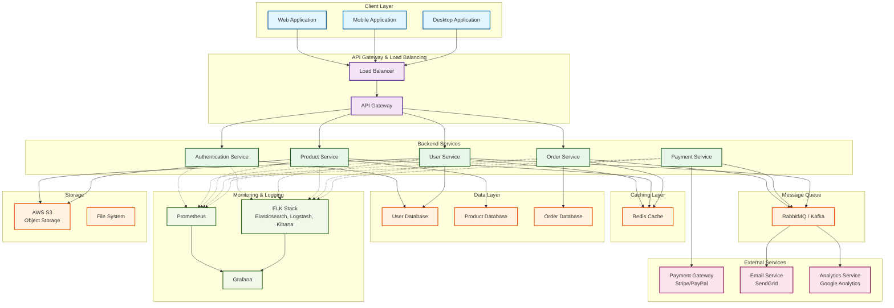

# Architecture Overview

This document provides a comprehensive overview of the system architecture, illustrating how different components interact and communicate with each other.

## System Architecture Diagram

## Architecture Components

### 1. **Client Layer**
- **Web Application**: Browser-based interface for desktop users
- **Mobile Application**: Native or cross-platform mobile apps (iOS/Android)
- **Desktop Application**: Standalone desktop client

### 2. **API Gateway & Load Balancing**
- **Load Balancer**: Distributes incoming traffic across multiple servers
- **API Gateway**: Entry point for all client requests, handles routing, authentication, rate limiting

### 3. **Backend Services**
Microservices architecture with independent, scalable services:
- **Authentication Service**: Manages user login, JWT tokens, OAuth integration
- **User Service**: Handles user profiles, preferences, account management
- **Product Service**: Manages product catalog, inventory, categories
- **Order Service**: Processes orders, order tracking, status updates
- **Payment Service**: Handles payment processing, transaction management

### 4. **Caching Layer**
- **Redis**: In-memory cache for frequently accessed data, session storage, reducing database load

### 5. **Data Layer**
- **User Database**: Stores user credentials, profiles, preferences
- **Product Database**: Stores product information, inventory, pricing
- **Order Database**: Stores order history, transaction details

### 6. **Message Queue**
- **RabbitMQ/Kafka**: Asynchronous message processing, decouples services, handles event streaming

### 7. **External Services**
- **Payment Gateway**: Stripe or PayPal integration for payment processing
- **Email Service**: SendGrid or similar for transactional emails
- **Analytics Service**: Google Analytics for user behavior tracking

### 8. **Storage**
- **AWS S3**: Cloud object storage for images, documents, backups
- **File System**: Local file storage for temporary files

### 9. **Monitoring & Logging**
- **Prometheus**: Metrics collection and time-series database
- **ELK Stack**: Centralized logging (Elasticsearch, Logstash, Kibana)
- **Grafana**: Visualization and alerting dashboard

## Data Flow

1. **Client Request**: User initiates an action through a client application
2. **Load Balancing**: Request is distributed to available servers
3. **API Gateway**: Routes request to appropriate microservice
4. **Authentication**: Validates user credentials and permissions
5. **Service Processing**: Relevant microservice processes the business logic
6. **Cache Check**: Service checks cache before querying database
7. **Database Query**: If not in cache, data is retrieved from database
8. **Async Operations**: Long-running tasks are queued for background processing
9. **External Integrations**: Required external service calls are made (payments, emails)
10. **Response**: Result is returned to client through API Gateway

## Key Architectural Principles

- **Scalability**: Microservices can be scaled independently based on demand
- **Resilience**: Service failures don't cascade; circuit breakers and retries are implemented
- **Separation of Concerns**: Each service has a single responsibility
- **Asynchronous Processing**: Heavy operations use message queues to avoid blocking
- **Observability**: Comprehensive monitoring, logging, and tracing across all services
- **Security**: API Gateway enforces authentication and authorization
- **Performance**: Caching layer reduces database load and improves response times

## Deployment Architecture

- Services are containerized using Docker
- Orchestrated with Kubernetes for auto-scaling and high availability
- CI/CD pipeline for automated testing and deployment
- Infrastructure as Code (IaC) using Terraform or CloudFormation

## Technology Stack

| Layer | Technology |
|-------|-----------|
| Frontend | React, Vue.js, Flutter |
| Backend | Node.js, Python, Java, Go |
| API | REST/GraphQL, gRPC |
| Cache | Redis |
| Database | PostgreSQL, MongoDB, MySQL |
| Message Queue | RabbitMQ, Kafka, AWS SQS |
| Container | Docker |
| Orchestration | Kubernetes |
| Monitoring | Prometheus, Grafana |
| Logging | ELK Stack |
| Storage | AWS S3, GCS |

---

**Last Updated**: 2026-09-09
